# PySDQL
pysdql is a middleware between [Pandas](https://pandas.pydata.org/docs/index.html) and [SDQL](https://doi.org/10.1145/3527333). 
It parses the pandas code and transforms it to SDQL IR, which is then computed by the C++ code generated by SDQL.py.

# Installation
## Clone
```shell
git clone https://github.com/cxunka/pysdql.git
```

## Dependency
__Linux / Unix / Windows__
```
pip3 install requirements.txt
```

### Essential
```
pip3 install toml
pip3 install varname
```

### Optional
pandas and duckdb are optional packages. 
If these packages are installed, 
then pysdql will use duckdb and pandas to verify that the result is correct.

__You may use `pysdql.set_verify(False)` to turn it off.__
```
pip3 install duckdb
pip3 install pandas
```

## Configuration
The configuration file is `config.toml` under the pysdql package.

__You may use `pysdql.get_pysdql_path()` to get the absolute path of pysdql package.__

| Option | Type | Description |
| ------ | ---- | ----------- |
| `enable_verification` | `bool` | Whether to use pandas and duckdb to verify the correctness of the query. |
| `display_query` | `bool` | Whether display the query that is generated and executed. |
| `display_result` | `bool` | Whether display the result of a query. |

# Write a Query
With using the `tosdql` decorator, a query in pandas can be transformed to SDQL. 
If pandas was installed, the result will be as the same type and value as that in pandas. 
Otherwise, it will be transformed to python built-in types.

## Example 1.1: Load Data
```
import pysdql as pd

li = pd.read_csv(f"path/to/dataset/lineitem.tbl",
                 sep='|',
                 header=None,
                 names=['l_orderkey', 'l_partkey', 'l_suppkey', 'l_linenumber', 'l_quantity',
                        'l_extendedprice', 'l_discount', 'l_tax', 'l_returnflag', 'l_linestatus',
                        'l_shipdate', 'l_commitdate', 'l_receiptdate', 'l_shipinstruct', 'l_shipmode', 'l_comment'],
                 index_col=False,
                 dtype={"l_orderkey": int, "l_partkey": int, "l_suppkey": int, "l_linenumber": int,
                        "l_quantity": float, "l_extendedprice": float, "l_discount": float, "l_tax": float,
                        "l_returnflag": str, "l_linestatus": str, "l_shipinstruct": str, "l_shipmode": str,
                        "l_comment": str},
                 parse_dates=['l_shipdate', 'l_commitdate', 'l_receiptdate'])
```

## Example 1.2: `tosdql` decorator
```
@tosdql
def query(lineitem):
    lineitem['revenue'] = lineitem.l_extendedprice * lineitem.l_discount

    result = lineitem.agg({'revenue': 'sum'})

    return result

print(query(li))
```
__output__
```
>> Optimized Query <<
revenue    1.080857e+09
dtype: float64
```

## Example 1.3: `.run_in_sdql()`
When decorators are not applicable, use `result.run_in_sdql()`, 
which is equivalent to the decorator.
```
result = (li.l_extendedprice * li.l_discount).sum()

result = result.run_in_sdql()

print(result)
```
__output__
```
1080857048.824976
```

# TPC-H Test
pysdql provides all 22 TPC-H benchmark queries to verify the correctness, 
to run these queries, `pysdql.tpch_query()` is particularly useful.

The templates for TPC-H queries are provided in `pysdql/query/tpch/template.py`

## Example 2.1: TPC-H Benchmark
```python
import pysdql

# test single query
pysdql.tpch_query(1)

# test single query
pysdql.tpch_query(1)

# test a range of queries
pysdql.tpch_query(range(1, 11))

# test a list of queries
pysdql.tpch_query([1, 11, 21])

# set optimize=False to get unoptimized results
pysdql.tpch_query(1, optimize=False)

# set execution_mode and threads_count
pysdql.tpch_query(1, execution_mode=0, threads_count=1)

# set verbose=False summary results
pysdql.tpch_query(1, verbose=True)
```

# Query Plans
## Q1
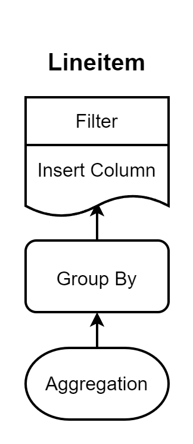
## Q2

## Q3

## Q4
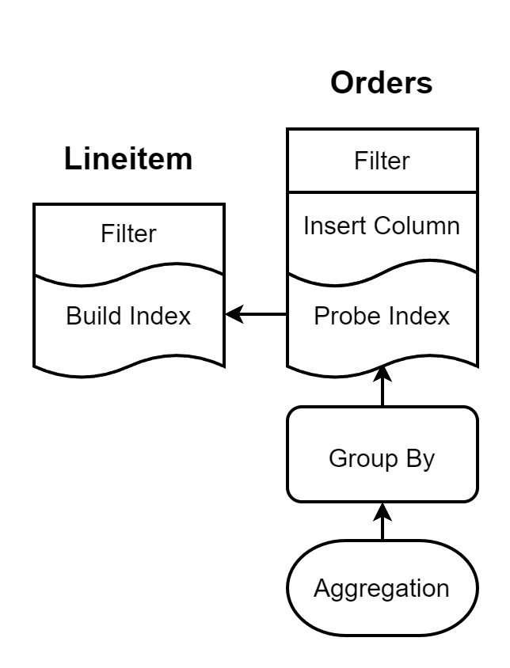
## Q5

## Q6
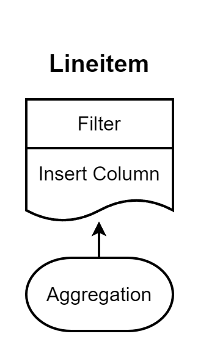
## Q7
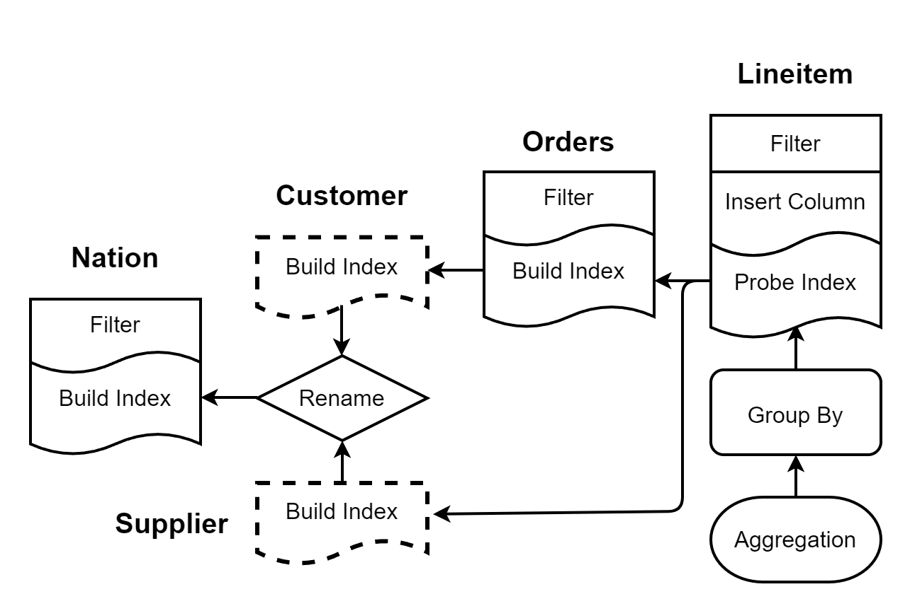
## Q8

## Q9
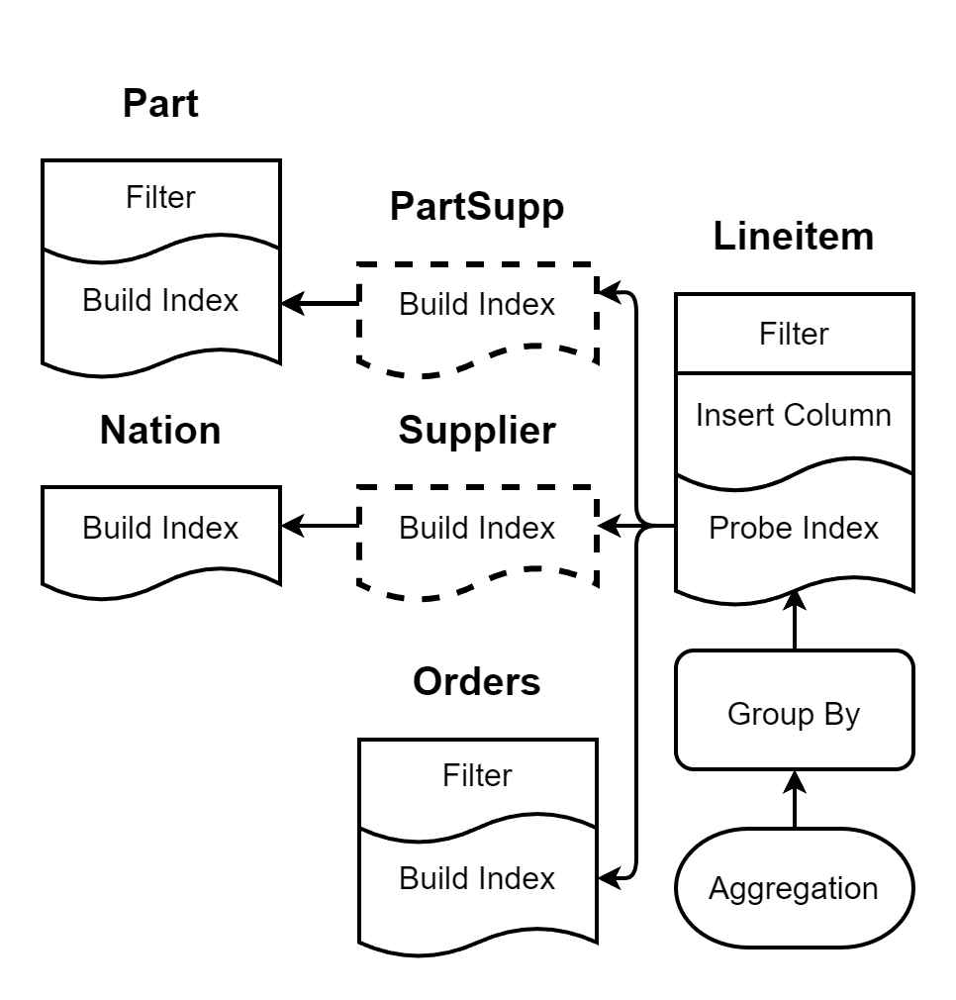
## Q10
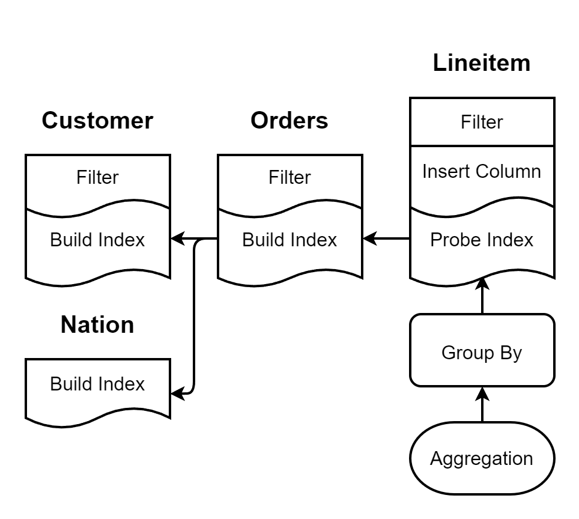
## Q11
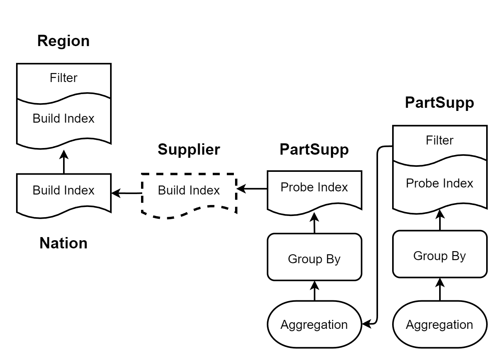
## Q12
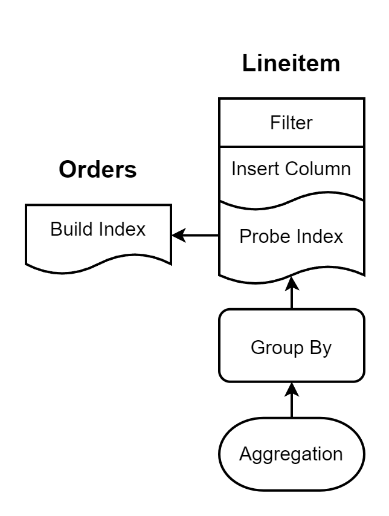
## Q13
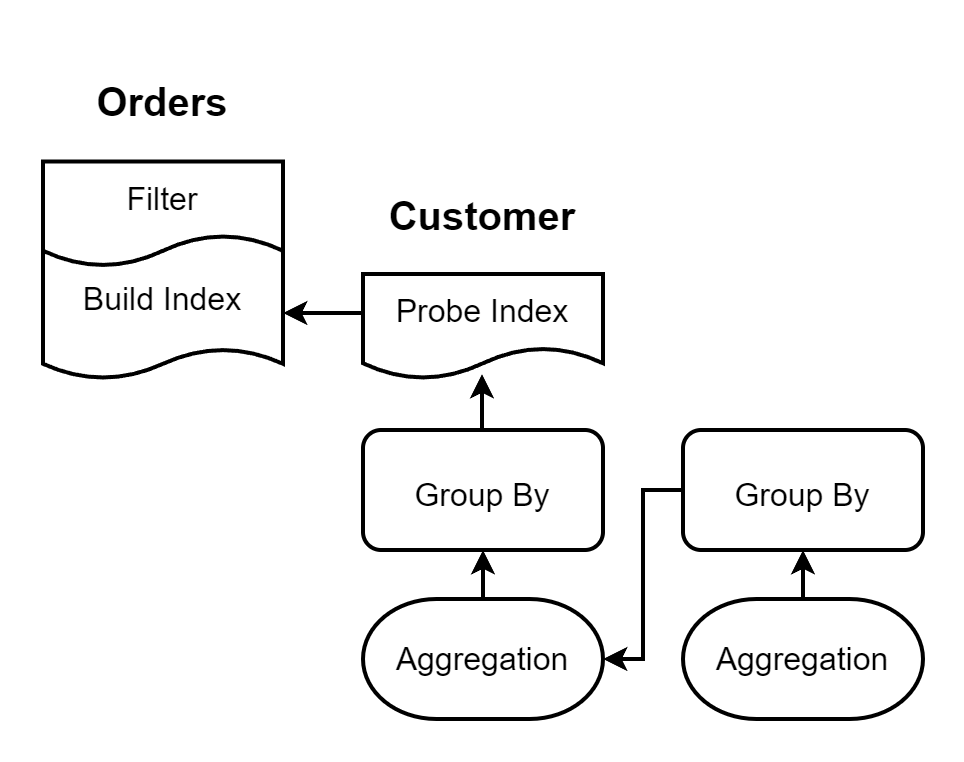
## Q14
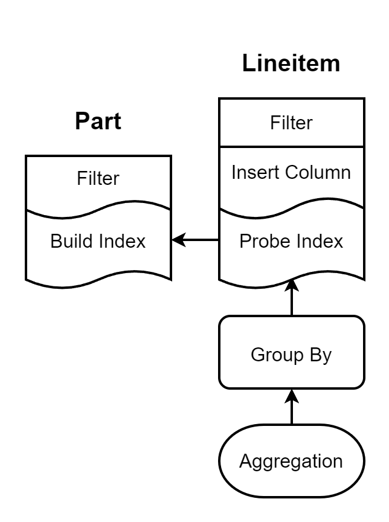
## Q15
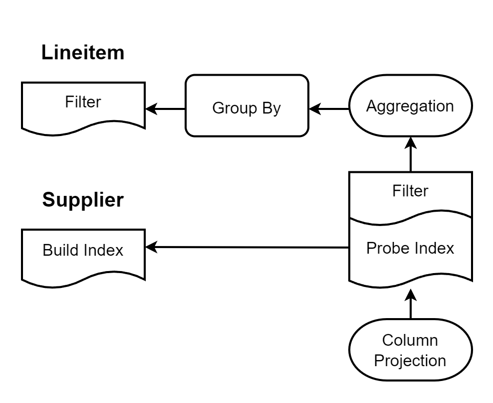
## Q16

## Q17
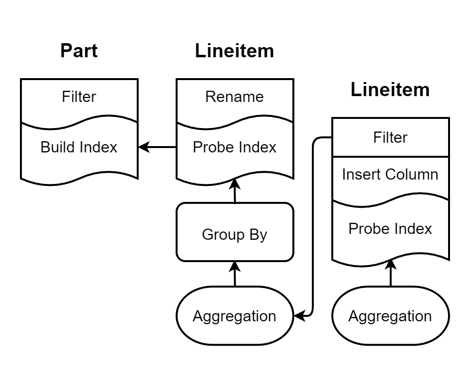
## Q18
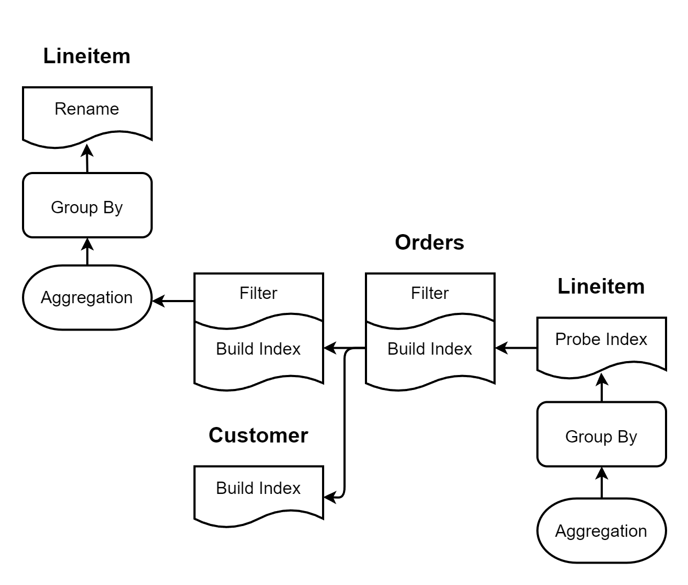
## Q19

## Q20
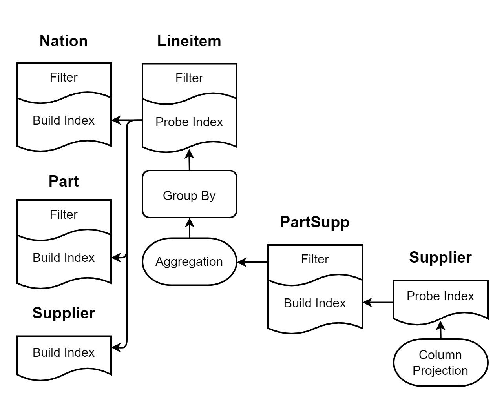
## Q21
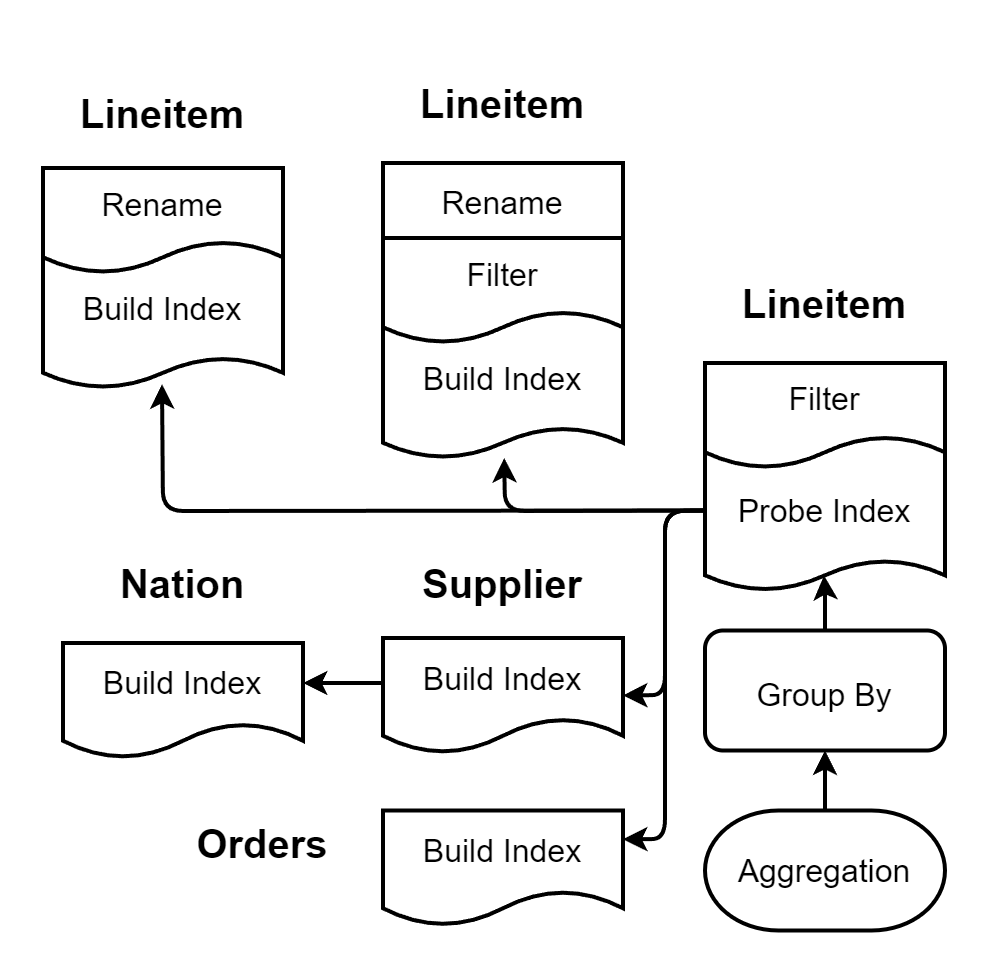
## Q22
